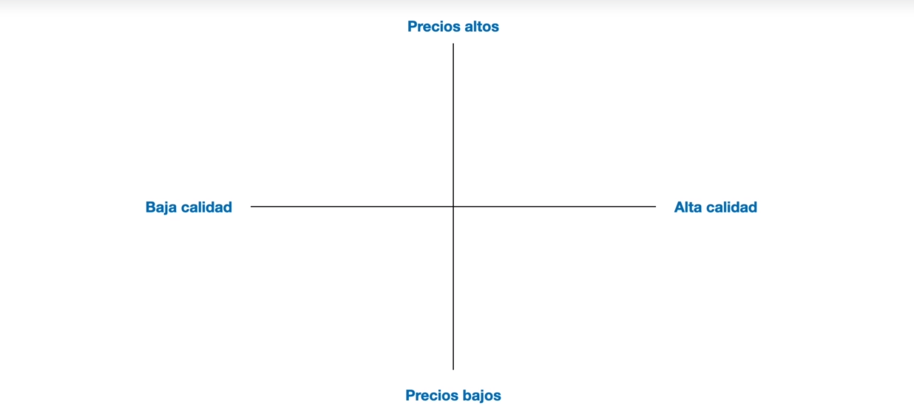
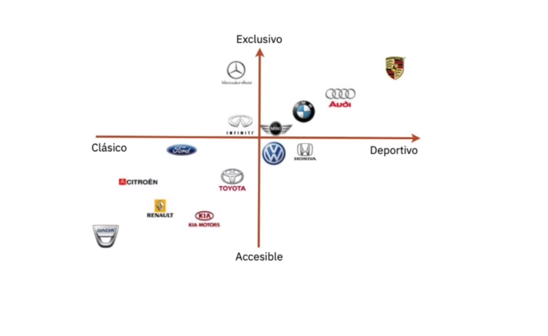

# Usability

Usabilidad no puede ser definido como metodo de calidad

> Disiplina que estudia la forma de diseñar sitios web, apps, etc para que los usuarios puedan interacutar con ellos lo mas facil, comda e intutivamente posible

La mejor forma apra crear un sitio web usable es realizando un diseño centrao en el usuario, diseñado para y por el usuario, **Facilicidad de uso**
# Design thinking
 Es un abordaje basado en metodos para la solucion de problemas que utilzia tecnicas y herramientas propias del pensaminetos proyectual. Es por sobre todos, un nuevo modelo cultural sobre la forma en que trabajamos
 Se divide por 5 etapas
 - Empatizar
 - definir
 - idear
 - prototipar
 - evaluar
 # UX research
 Es la diciplina que se centra en la diciplina en empatizar en los clientes
 > Lo que las personas dicen no es lo que las personas hacen y viceversa
 # Unidad 1 Investigacion
 Todas las tecnicas de investigacion de usuauiros tiene en comun es que ayudan a colocar a las personas en el centro del proceso
 - shadowing: acompañar al usuario mientras realiza sus actividades o incluso hacer el papel del usuario
 ## 3 Razones para hacer una investigacion de usuarios:
 - Para crear diseños que sean verdaderamente relevantes para los usuaios
 - para crear diseños que sean faciles y agradlaes de usar
 - para comprender el retorno de la inversion ROI del diseño UX (Ganancia - inversion) / inversion
 ### Analisis de competidores (tipos de competidores)

 #### Comnpetencia directa
 Son todos aquellos que resulve un problema igual o casi igual al nuestro y que lo hacen para el mismo segmento del usuario en el que estamos nosotros
 #### Competencia indirecta
 Son todos aqueelos que no resulven lo mismo que nosotros, pero pueden llegar a satisfacer parcialmente la mimsa necesidades
 Ejemploss:
 - Necesidad de hidratarse
 - Necesidad de energizarse
 - Necesidad de algo dulce
 #### Mapa de competencia

 El mapa de competencia consiste en uicar nuestro competidores en un mapa compuesto por dos ejes
 
 
 #### Innovacion y creatividad
 > "Los buenos artitas copian los grandes roban."
 > "Casi todo está creado es cuestion de saber que usar y el contexto"
 # Benchmarking
 Es una tecnica basa en conocer mejores practicas fuera de la empresa, sino **ENTENDER EL PROCESO DE ESA SOLUCION**
 - Benchmarking interno una determina area de la emporesa que esta opteniendo muy bueno resultados
 - Benchmarkinbg funcionl se aplica con empresa que podrian ser o no competidoras directas
 ## Proceso de benchmarking
 - Definir objectivos a mejorar
 - ¿ A quien nos comparamos?
 - Analizar
 - Adaptar mejoras
